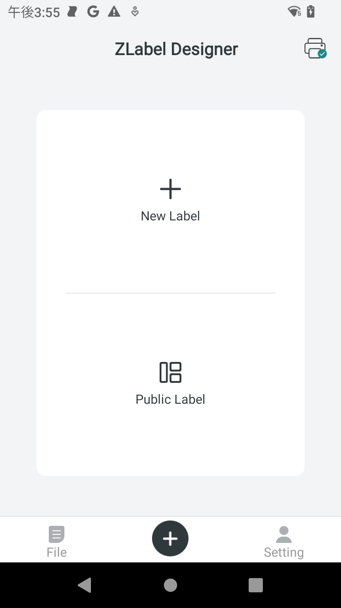
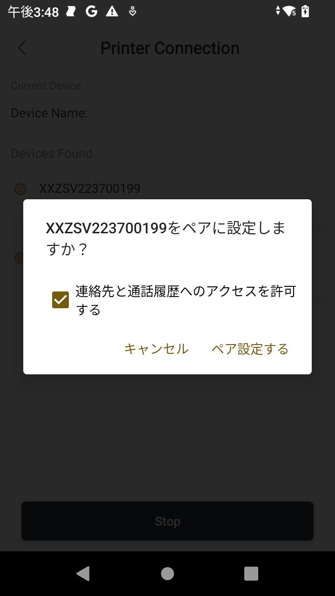
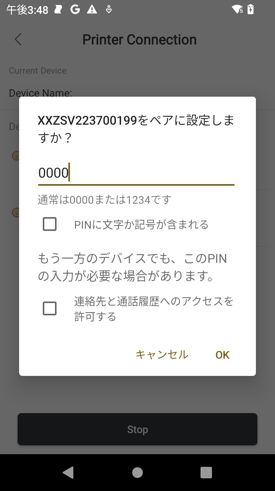
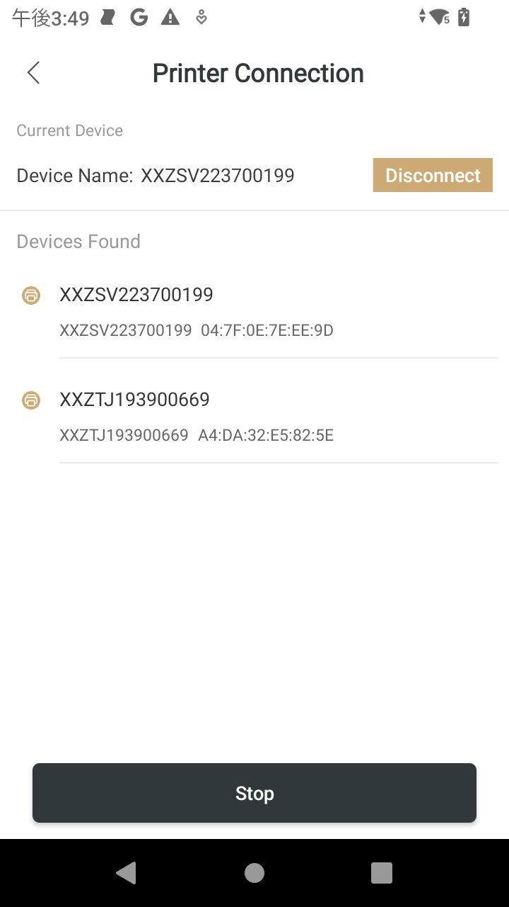

# Zebra-Printer_Pair ZQ220plus with Zlabel

### Zlabelで新規ZQ220+プリンタをペアリングする方法

1. Zlabel をスマホ端末にインストールする

    [Zlabel for Android](https://play.google.com/store/apps/details?id=com.zlabel.designer&hl=en&gl=US)
    [Zlabel for iphone](https://apps.apple.com/gb/app/zlabel-designer/id1639967110)

 

1. スマホのbluetooth設定をONにする。

 

1. Printer Iconを選択する。

    

 

1. 対象のプリンタ（シリアル番号表記）を選択する。

 

1. 初回は認証を求められる。下記画面を参考に処理を進めること。

     
    

 

1. 接続完了
    
